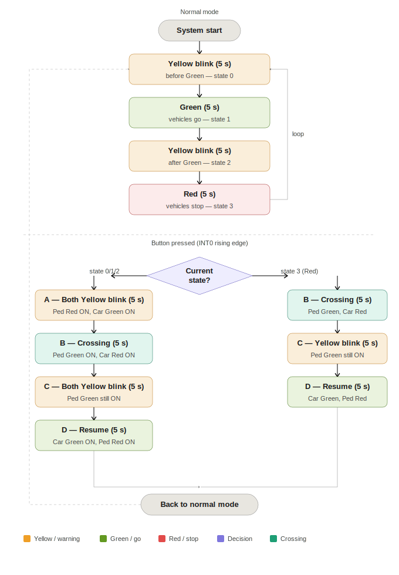

# 🚦 Traffic Light System with On-Demand Crosswalk

A bare-metal embedded traffic light controller for the **ATmega32 microcontroller**, featuring interrupt-driven pedestrian crossing and a clean 3-layer software architecture. Built as the capstone project of the **Embedded Software Professional Nanodegree** — offered by the **Egyptian Ministry of Communications and Information Technology (MCIT)** in collaboration with **Udacity**.

[](https://github.com/Muhamed-Ramadan)
[](https://www.linkedin.com/in/muhamed-ramadan)

---

## 📌 Table of Contents

- [Project Overview](#project-overview)
- [System Demo](#system-demo)
- [Hardware Requirements](#hardware-requirements)
- [Software Architecture](#software-architecture)
- [System Behavior](#system-behavior)
- [State Machine Flowchart](#state-machine-flowchart)
- [Project Structure](#project-structure)
- [Drivers & APIs](#drivers--apis)
- [Key Implementation Details](#key-implementation-details)
- [Getting Started](#getting-started)
- [Testing](#testing)
- [Known Limitations & Future Work](#known-limitations--future-work)

---

## Project Overview

This project implements a **real-time traffic light controller** for vehicles and pedestrians. In normal mode the vehicle signal cycles automatically through Green → Yellow (blink) → Red → Yellow (blink). A pedestrian crosswalk button connected to the external interrupt INT0 can interrupt the current cycle at any point and trigger a safe crossing sequence.

The system is written in **bare-metal C** with no operating system and no HAL library — all hardware access goes through a custom driver stack built from scratch using memory-mapped register macros, following **SOLID principles** and a **layered architecture**.

---

## System Demo

### Proteus Simulation Circuit


The circuit includes two 3-LED traffic lights (vehicle and pedestrian) and a push button connected to INT0.

### Simulation GIF

> 📽️ *GIF placeholder — record a short Proteus simulation showing the full pedestrian crossing sequence (Normal Mode → button press → crossing → return to Normal) and replace this line with:*
> ```
> 
> ```
> **How to record:** Run the simulation in Proteus, use OBS or ShareX to screen-record ~15–20 seconds covering one full crossing cycle. Export as GIF (keep under 10 MB) and place it in the repo root as `demo.gif`.

---

## Hardware Requirements

| Component | Details |
|---|---|
| Microcontroller | ATmega32 @ 8 MHz |
| Vehicle LEDs | Green (PA0), Yellow (PA1), Red (PA2) — Port A |
| Pedestrian LEDs | Green (PB0), Yellow (PB1), Red (PB2) — Port B |
| Push Button | INT0 (PD2), rising-edge triggered, 230Ω pull-down |
| IDE | Microchip Studio (Atmel Studio) |
| Simulator | Proteus Design Suite |

---

## Software Architecture

The project follows a strict 3-layer architecture — each layer depends only on the one below it:

```
┌──────────────────────────────────────────┐
│           Application Layer              │
│   app.c / app.h                          │
│   System logic, state machine, ISR       │
├──────────────────────────────────────────┤
│              MCAL Layer                  │
│   ext_int.c  — External Interrupt (INT0) │
│   timers.c   — Timer0 driver             │
│   isr_interrupt.h — ISR vector macros    │
├──────────────────────────────────────────┤
│            Utility Layer                 │
│   bit_math.h   — Bit manipulation macros │
│   data_types.h — Portable type aliases   │
│   registers.h  — Register address macros │
└──────────────────────────────────────────┘
```

---

## System Behavior

### Normal Mode

The vehicle signal cycles continuously. Each state lasts 5 seconds:

```
GREEN  ──►  YELLOW (blink×4)  ──►  RED  ──►  YELLOW (blink×4)  ──►  GREEN ...
```

The pedestrian signal is **inactive during normal mode** — it only activates when the crosswalk button is pressed. This matches real-world pedestrian signal behavior.

### Pedestrian Mode

Pressing the button triggers INT0 (rising edge only — long press has no effect). The response depends on which normal-mode state was active at the moment of the press:

| Scenario | Condition at press | Response |
|---|---|---|
| 1 | Car Green is ON | Yellow blink (5s) → Car Red + Ped Green (5s) → transition back |
| 2 | Car Yellow is blinking | Yellow blink (5s) → Car Red + Ped Green (5s) → transition back |
| 3 | Car Red is already ON | Car Red + Ped Green immediately (5s) → transition back |
| 4 | Long press | No action (INT0 triggers only on rising edge) |
| 5 | Double press | First press handled normally; second press ignored |

**End of every crossing sequence:**

```
Both Yellow blink (5s)  ──►  Car Green + Ped Red (5s)  ──►  Normal Mode resumes
```

---

## State Machine Flowchart



---

## Project Structure

```
traffic-light-system/
├── src/
│   ├── main.c
│   ├── app/
│   │   ├── app.c                   # System logic, state machine, ISR
│   │   └── app.h                   # Pin defines, state enum, prototypes
│   ├── mcal/
│   │   ├── external_interrupt/
│   │   │   ├── ext_int.c           # INT0/1/2 driver
│   │   │   └── ext_int.h
│   │   ├── isr_interrupts/
│   │   │   └── isr_interrupt.h     # ISR macro, sei/cli, vector names
│   │   └── timer/
│   │       ├── timers.c            # Timer0: init, delay, force-stop
│   │       └── timers.h
│   └── utility/
│       ├── bit_math.h              # SET/CLR/TGL/GET bit macros
│       ├── data_types.h            # u8, u16, u32, s8 ...
│       └── registers.h             # PORTA, TCCR0, GICR ... macros
├── tests/
│   ├── test_ext_interrupt/
│   ├── test_isr/
│   ├── test_timer/
│   └── test_bit_math/
├── simulation/
│   └── sim.pdsprj
├── design/
│   ├── system-design.docx
│   └── system-design.pdf
├── docs/
│   ├── ATmega32_Datasheet.pdf
│   ├── system-flowchart.svg
│   └── demo-videos/
│       ├── user-story-1.mkv
│       ├── user-story-2.mkv
│       ├── user-story-3.mkv
│       ├── user-story-4.mkv
│       ├── user-story-5.mkv
│       ├── testing/
│       └── driver-walkthroughs/
├── simulation_screenshot.png
├── traffic_light.atsln
├── .gitignore
└── README.md
```

---

## Drivers & APIs

### Utility Layer

#### `bit_math.h`
```c
SETBit(REG, BIT_NO)    // Set single bit
CLRBit(REG, BIT_NO)    // Clear single bit
TGLBit(REG, BIT_NO)    // Toggle single bit
GETBit(REG, BIT_NO)    // Read single bit
SETBits(REG, bMsk)     // Set bits by mask
CLRBits(REG, bMsk)     // Clear bits by mask
SETALLBits(REG)        // Set all bits
CLRALLBits(REG)        // Clear all bits
```

#### `data_types.h`
```c
typedef unsigned char  u8;
typedef unsigned int   u16;
typedef unsigned long  u32;
typedef signed char    s8;
```

#### `registers.h`
Memory-mapped access to ATmega32 registers via `SELECTOR(ADDRESS)` — covers Port A/B/C/D, External Interrupt registers (MCUCR, GICR), and Timer0 registers (TCCR0, TCNT0, TIMSK).

---

### MCAL Layer

#### `timers.c`
```c
void Timer0_Init(timer_modes_EN mode, Prescaler_EN prescaler);
void Timer0_Start(void);
void Timer0_Stop(void);
void ResetTimer(void);
void timer_delay_us(u32 delay);   // Busy-wait delay in microseconds
void Force_Stop_Timer0(void);     // Forces any in-progress delay to exit immediately
```

#### `ext_int.c`
```c
void INT_init(INT_NUM int_num, SENSE_CONTROL sense_control);
// int_num:       INT_0 | INT_1 | INT_2
// sense_control: low_level | any_level | rising_edge | falling_edge
```

#### `isr_interrupt.h`
```c
sei()          // Enable global interrupts
cli()          // Disable global interrupts
ISR(INT_VECT)  // Declare ISR — vectors: INT0_vect, TIMER0_OVF_vect
```

---

### Application Layer

#### `app.c`
```c
void APP_Start(void);       // Initialize GPIO, Timer0, INT0
void APP_Run(void);         // Main loop: Normal Mode + mode switching
void Pedestrian_Mode(void); // Full crossing sequence (state-aware)
ISR(INT0_vect);             // Button handler: sets flag, exits current delay
```

**Global state variables:**

| Variable | Type | Role |
|---|---|---|
| `state` | `STATE_type` | Current normal-mode state |
| `pedestrian_mode_flag` | `u8` | 0 = normal mode, 1 = pedestrian mode active |
| `ON_Period` | `u32` | Active delay period; zeroed by ISR to skip remaining wait |

---

## Key Implementation Details

### Challenge: interrupt-safe state exit

When the button is pressed mid-cycle, the system must exit the current 5-second delay immediately. Two mechanisms work together in `ISR(INT0_vect)`:

```c
ISR(INT0_vect) {
    if (pedestrian_mode_flag == 0) {
        pedestrian_mode_flag = 1;
        ON_Period = 0;          // next timer_delay_us(0) call returns instantly
        Force_Stop_Timer0();    // exits any in-progress delay on next iteration
    }
}
```

`ON_Period = 0` handles a press between two delay calls. `Force_Stop_Timer0()` handles a press *during* a delay call — it sets the overflow counter to `~0` so the busy-wait loop exits on its very next check.

### Challenge: double-press and re-entrancy prevention

`pedestrian_mode_flag` is a one-shot guard. Once set to `1` by the ISR, the `if (pedestrian_mode_flag == 0)` check blocks any further button press from re-triggering the pedestrian sequence. The flag is only reset at the very end of `Pedestrian_Mode()`, after the full crossing sequence completes.

### State-aware crossing

`Pedestrian_Mode()` reads the `state` variable to decide whether the Yellow warning blink is necessary:

- State is `RED` → cars are already stopped → skip the Yellow blink, proceed directly to Ped Green.
- Any other state → show Yellow blink on both signals first, then proceed to Ped Green.

The system never skips a safety step regardless of when the button is pressed.

---

## Getting Started

### Prerequisites
- [Microchip Studio](https://www.microchip.com/en-us/tools-resources/develop/microchip-studio)
- [Proteus Design Suite](https://www.labcenter.com/)

### Run the simulation
1. Clone the repository
2. Open `traffic_light.atsln` in Microchip Studio → Build → produces `src/Debug/traffic_light.hex`
3. Open `simulation/sim.pdsprj` in Proteus
4. Load the `.hex` into the ATmega32 component
5. Run — press the button to trigger pedestrian mode

---

## Testing

| Module | What it validates |
|---|---|
| `test_bit_math` | All bit manipulation macros |
| `test_timer` | Timer0 init, delay accuracy, `Force_Stop` behavior |
| `test_ext_interrupt` | INT0 initialization and sense control |
| `test_isr` | ISR macro expansion and vector binding |

### User story results

| Story | Scenario | Expected | Result |
|---|---|---|---|
| US-1 | Short press while car Green ON | Yellow blink → Car Red + Ped Green | ✅ Pass |
| US-2 | Short press while car Yellow blinking | Yellow blink → Car Red + Ped Green | ✅ Pass |
| US-3 | Short press while car Red ON | Ped Green immediately | ✅ Pass |
| US-4 | Long press | No action | ✅ Pass |
| US-5 | Double press | First press handled, second ignored | ✅ Pass |

Demo recordings for all user stories are in `docs/demo-videos/`.

---

## Known Limitations & Future Work

**No HAL for LEDs and button**
The application layer controls LEDs and reads the button directly using `bit_math.h` macros, without a dedicated GPIO Hardware Abstraction Layer. This couples pin assignments to the application logic. A proper HAL (e.g., `hal/led.c`, `hal/button.c`) would improve portability and testability, and is the natural next step in the architecture.

**Potential improvements**
- Add GPIO HAL for LED and button abstraction
- Add software debouncing at the HAL level
- Replace busy-wait delays with interrupt-driven timing for better CPU efficiency
- Extend to support multiple crosswalk directions

---

## Author

**Mohamed Ramadan**

[](https://github.com/Muhamed-Ramadan)
[](https://www.linkedin.com/in/muhamed-ramadan)